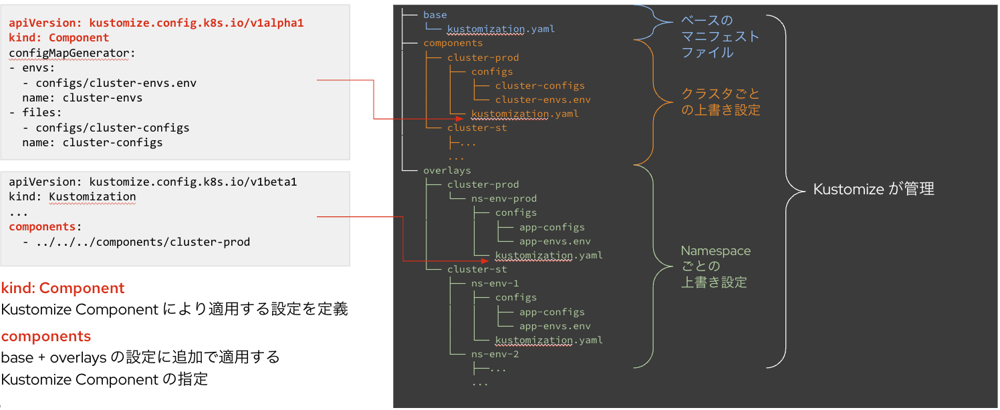
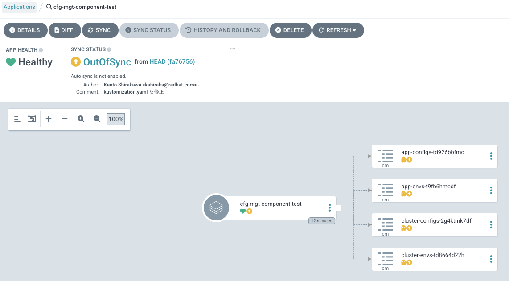
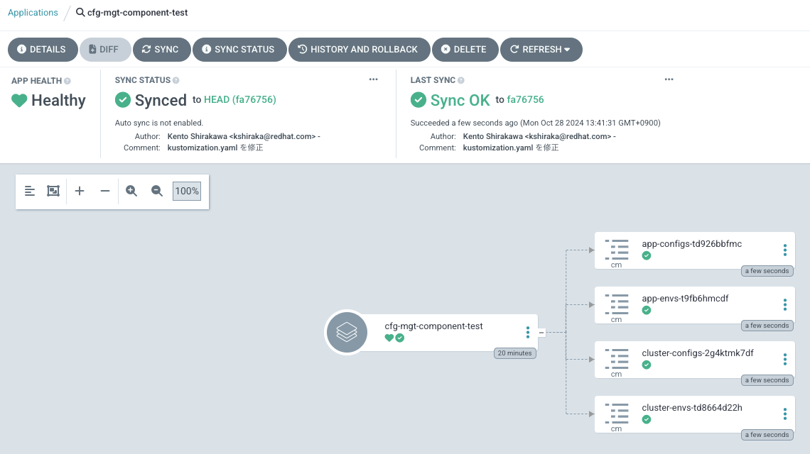

# マニフェストの差分をディレクトリ構成 / Kustomize Component で管理

## 事前準備

- OpenShift GitOps をインストール済みであること

## GitOps セットアップ

`gitops-test` namespaceに ArgoCD インスタンスと ArgoCD Application を起動する。

```bash
$ oc new-project gitops-test
$ oc apply -f argocd/

// argocd-repo-serverのコンテナが2つ起動していること
$ oc get pod
NAME                                  READY   STATUS      RESTARTS   AGE
argocd-application-controller-0       1/1     Running     0          1h 
argocd-dex-server-77c9844c7b-vxlsz    1/1     Running     0          1h 
argocd-redis-5dcb4b8449-gp467         1/1     Running     0          1h 
argocd-repo-server-69f687779c-5kwl6   2/2     Running     0          1h 
argocd-server-f4fbfb677-96n5p         1/1     Running     0          1h 
```

## 設定のポイント



## ローカルでの ConfigMap 作成テスト

```bash
$ oc kustomize overlays/cluster-prod/ns-env-prod 

apiVersion: v1
data:
  app-configs: |
    ns-env-prod
kind: ConfigMap
metadata:
  name: app-configs-td926bbfmc
  namespace: ns-env-prod
---
apiVersion: v1
data:
  NS: ns-env-prod
kind: ConfigMap
metadata:
  name: app-envs-t9fb6hmcdf
  namespace: ns-env-prod
---
apiVersion: v1
data:
  cluster-configs: |
    cluster-prod
kind: ConfigMap
metadata:
  name: cluster-configs-2g4ktmk7df
  namespace: ns-env-prod
---
apiVersion: v1
data:
  CLUSTER: cluster-prod
kind: ConfigMap
metadata:
  name: cluster-envs-td8664d22h
  namespace: ns-env-prod
```

## アプリケーションデプロイ

以下の通りアプリケーションが作成されている。まだ Sync 前



"Sync"ボタンを押してSyncすると、マニフェストの適用が行われる。


